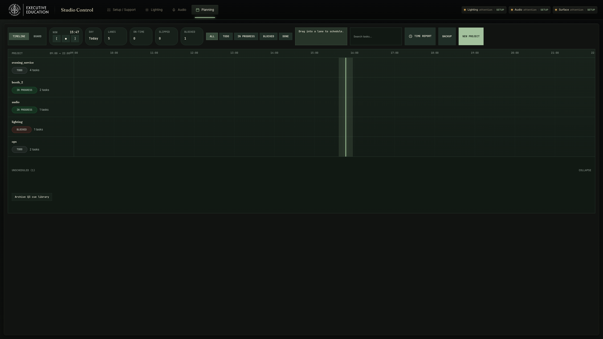
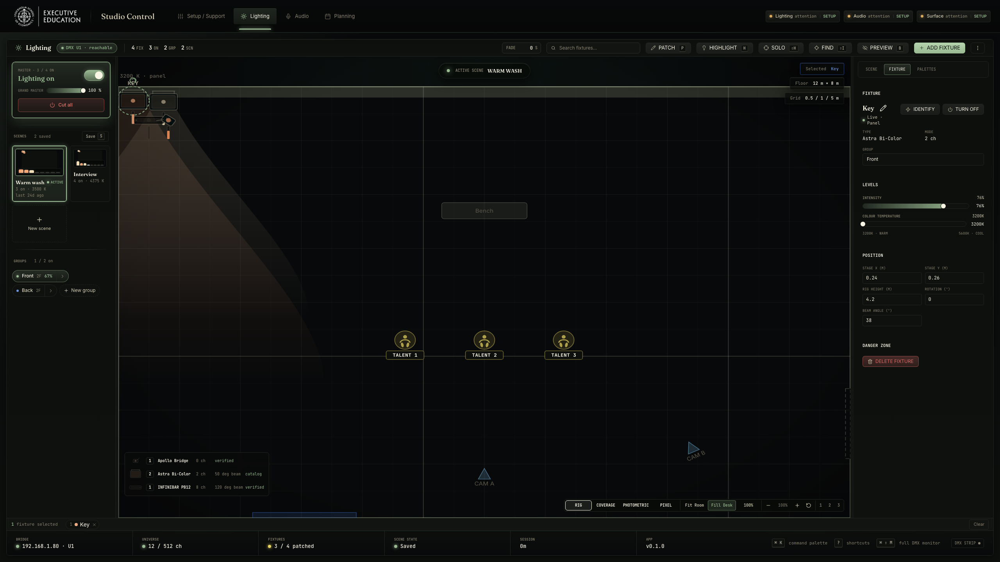
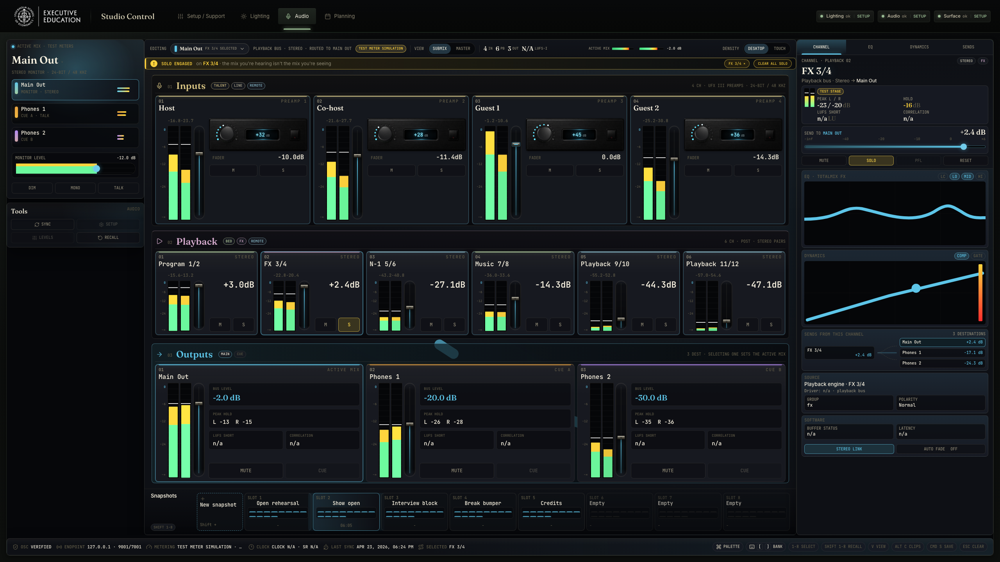
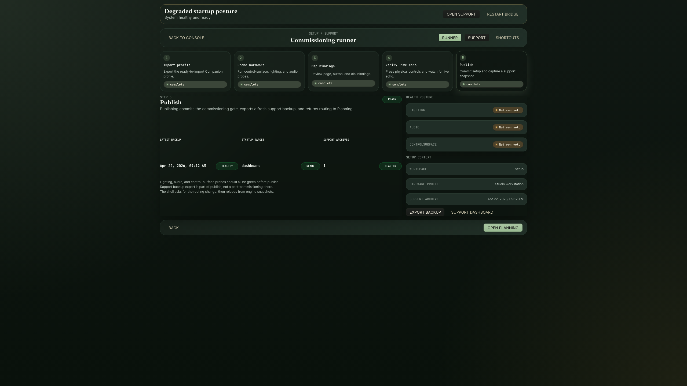

# SSE ExEd Studio Control

SSE ExEd Studio Control is a local-first desktop control application for a fixed studio workstation. It combines production planning, lighting control, audio control, and Stream Deck commissioning into one operator-facing surface designed to stay open full-time on a dedicated second monitor.

This repository is intentionally optimized for a specific deployment profile rather than a generic SaaS dashboard:

- desktop-first, local-only operation
- permanent 27-inch 16:9 second-monitor layout
- live lighting and audio control under time pressure
- fixed studio hardware assumptions instead of broad hardware abstraction

## Architecture

- selected native `Tauri + React + TypeScript` operator shell for the shipping runtime
- retained `Qt/QML` fallback shell pending Checkpoint D retirement planning
- separate `Rust` engine (persistence, safety, device logic)
- offline Qt Installer Framework packages on Windows 11 `x64` and macOS Apple Silicon
- one-way importer for legacy `db.json` data, invoked once on first native launch for migrating operators

## Distribution Targets

- Windows 11 `x64` packaged as a Qt Installer Framework offline installer
- macOS Apple Silicon packaged as a Qt Installer Framework offline installer
- GitHub Releases as the installer and update-repository artifact backend
- One fixed studio workstation as the primary production target

## Download

Release artifacts are published through [GitHub Releases](https://github.com/Fikarn/sse-exed-studio-control/releases/latest).

- Windows: install the generated native `.exe` offline installer
- macOS: install from the generated native offline installer archive
- Updates: use the published native maintenance-tool update repository artifacts for controlled workstation updates
- Integrity: verify downloads against the published per-platform `SHA256` manifest before operator rollout
- Trust: expect unsigned-installer warnings on macOS and Windows and handle them as a deliberate operator-managed install, not a public self-serve consumer install

Productization work and release gates are tracked in [docs/PRODUCTIZATION_PLAN.md](docs/PRODUCTIZATION_PLAN.md) and [docs/RELEASE.md](docs/RELEASE.md).

## Screenshots

All captures below are deterministic native renders at the target `2560x1440` operator-monitor resolution. The checked-in release screenshots remain historical Qt-shell parity captures; current Tauri visual review is produced through the local cutover-readiness lanes described in [docs/FRONTEND_CUTOVER_PLAN.md](docs/FRONTEND_CUTOVER_PLAN.md).

| Planning                                                                                             | Lighting                                                                                                    |
| ---------------------------------------------------------------------------------------------------- | ----------------------------------------------------------------------------------------------------------- |
|  |  |

| Audio                                                                                             | Setup / Commissioning                                                                                            |
| ------------------------------------------------------------------------------------------------- | ---------------------------------------------------------------------------------------------------------------- |
|  |  |

## Operator Lifecycle

- First launch starts the selected native shell, launches the bundled Rust engine, and waits for engine readiness before routing into commissioning or the dashboard
- First-run commissioning is available from inside the app for planning, lighting, and Companion setup
- Closing the main window shows a warning and then fully quits the app if confirmed
- Restored workspace and shell state come from the engine snapshot, not shell-local browser state
- User data stays local on the workstation and survives reinstall/update flows unless manually removed

Operator support details live in [docs/OPERATIONS.md](docs/OPERATIONS.md).

## Product Surface

### Planning

- dense Kanban workspace for always-visible production tracking
- keyboard-first project and task operations
- timer, status, and priority visibility without consuming the whole console

### Lighting

- fixture control for the current studio lighting rig
- compact grid/list operator views plus a polished 2D studio plot
- DMX status visibility, scenes, grouping, and live spatial editing

### Audio

- fixed RME Fireface UFX III control surface
- front preamps `9-12`, rear line inputs `1-8`, software playback returns, and output-mix control
- main monitor and headphone mix workflows aligned to TotalMix FX concepts
- explicit safety model for live sync, recall, and phantom power handling

### Setup / Commissioning

- import-first Companion / Stream Deck setup workflow
- workstation-specific control-surface documentation
- commissioning layout that matches the production console language

## Hardware Profile

This project is deliberately tuned to the current studio installation.

- Display: dedicated second monitor, target `2560x1440`, minimum `1920x1080`
- Audio interface: RME Fireface UFX III
- Lighting bridge: Litepanels Apollo Bridge
- Control surface: Stream Deck+
- Companion workflow: local Bitfocus Companion instance

Full deployment assumptions live in [docs/HARDWARE_PROFILE.md](docs/HARDWARE_PROFILE.md).

## Repo Map

- [docs/HANDOFF.md](docs/HANDOFF.md): authoritative engineering handoff and current operating truth
- [docs/ARCHITECTURE.md](docs/ARCHITECTURE.md): runtime and domain boundaries
- [docs/DEVELOPMENT.md](docs/DEVELOPMENT.md): day-to-day engineering workflow
- [docs/OPERATIONS.md](docs/OPERATIONS.md): local operations and operator support
- [docs/RELEASE.md](docs/RELEASE.md): versioning, tagging, installers, and release flow
- [docs/OPERATOR_WORKSTATION_ROLLOUT.md](docs/OPERATOR_WORKSTATION_ROLLOUT.md): final published-installer verification on the intended studio workstation
- [docs/HARDWARE_PROFILE.md](docs/HARDWARE_PROFILE.md): supported studio hardware and scope
- [docs/PRODUCTIZATION_PLAN.md](docs/PRODUCTIZATION_PLAN.md): current production-readiness plan and open decisions
- [docs/FRONTEND_CUTOVER_PLAN.md](docs/FRONTEND_CUTOVER_PLAN.md): acceptance gate for completing the Tauri shipping switch
- [docs/archive/](docs/archive/): historical planning and parity documents preserved for reference
- [native/README.md](native/README.md): native workspace scaffold for the selected Tauri shell, Qt fallback shell, Rust engine, and IPC protocol
- [docs/adr/0001-frontend-replatform.md](docs/adr/0001-frontend-replatform.md): locked frontend replatform decision
- `frontend/`: Tauri web frontend workspace and design-system packages
- `native/tauri-shell/`: selected native shell track for the current published Tauri runtime

## Local Development

Prerequisites:

- Node.js 20
- npm
- Rust stable toolchain
- Qt 6 desktop SDK for local native builds
- Qt Installer Framework for local installer/update generation

```bash
npm install
npm run native:check
npm run native:test
npm run native:build
npm run native:shell:test
npm run native:package:mac:local
npm run native:package:mac:smoke
npm run native:package:mac:clean-smoke
npm run native:package:win:local
npm run native:package:win:smoke
npm run native:package:win:clean-smoke
npm run native:installer:mac:prepare
npm run native:installer:mac:local
npm run native:installer:win:prepare
npm run native:installer:win:local
npm run native:update-repo:mac:prepare
npm run native:update-repo:mac:local
npm run native:update-repo:win:prepare
npm run native:update-repo:win:local
npm run native:release:mac:local
npm run native:release:win:local
npm run native:smoke
npm run native:smoke:clean-start
npm run native:smoke:bundled-engine
npm run native:smoke:restart:clean-start
npm run native:smoke:lifecycle
npm run native:smoke:failures
npm run native:acceptance
```

On macOS, the native shell build auto-detects common Homebrew Qt prefixes. On Windows target-host Qt installs, `CMAKE_PREFIX_PATH`, `QT_ROOT_DIR`, `QTDIR`, `QT_DIR`, or `Qt6_DIR` may be used to resolve the Qt CMake package location.

Common commands:

```bash
npm run clean
npm run format:check
npm run native:foundation
npm run frontend:foundation
npm run tauri:foundation
npm run tauri:setup-support:qualify
npm run tauri:workspaces:qualify
npm run tauri:cutover:candidate
npm run ci
```

`tauri:setup-support:qualify` and `tauri:workspaces:qualify` launch the real Tauri dev shell on the fixed local port `4173`. Run them serially and do not run them alongside `npm run dev`, `npm run preview`, or Playwright preview.

`tauri:cutover:candidate` is the local Checkpoint A gate for the replacement shell.

The selected shipping release runtime is declared in `scripts/native-release-runtime.json`. `v2.2.0` completed the Tauri shipping-switch gate through the `native:*` release lane with macOS Apple Silicon and Windows 11 `x64` target-host evidence; `v2.2.1` is the current published operator-rollout build after the durable app-data default fix. The fallback window is closed, and Qt retirement planning is tracked in issue #5.

`npm run clean` removes generated native build output and packaged release folders.

## Release Model

Releases are changelog-driven and tag-driven:

1. Land changes on `main`
2. Bump `package.json` / `package-lock.json`
3. Move release notes from `[Unreleased]` into a versioned `CHANGELOG.md` section
4. Run `npm run release:verify`
5. Commit release metadata
6. Push `main`
7. Create and push a `vX.Y.Z` tag
8. Publish the locally built target-host artifacts with `npm run release:publish -- --tag vX.Y.Z`

Release builds are local/target-host gates, not GitHub Actions gates. The macOS Apple Silicon and Windows 11 `x64` release hosts build and verify their own installers, update-repository archives, and SHA256 manifests; `release:publish` uploads the checked artifacts to GitHub Releases using release notes generated from `CHANGELOG.md`.

## Engineering Standards

- local-first reliability beats feature breadth
- operator clarity beats decorative UI
- hardware-facing changes require explicit validation
- no silent live-state writes on screen open unless that behavior is intentional and documented
- repo docs should reflect the actual supported hardware and workflows

## License

[MIT](LICENSE)
